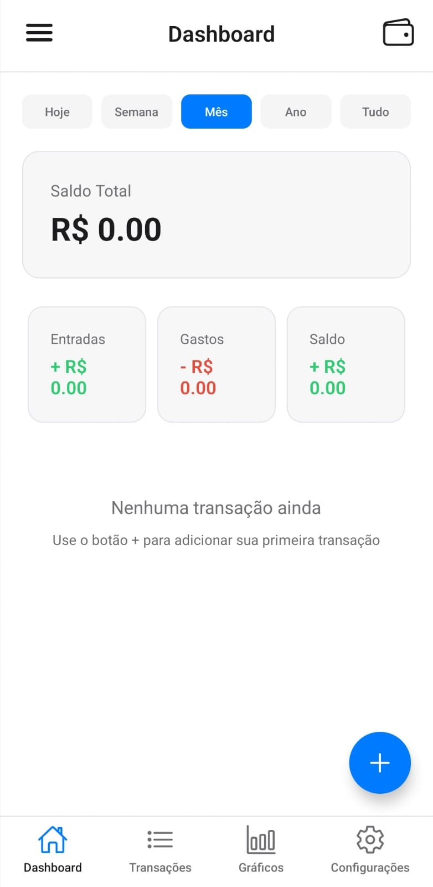
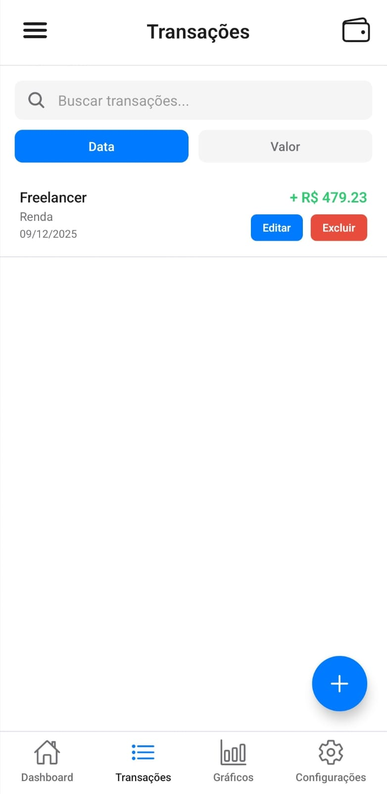
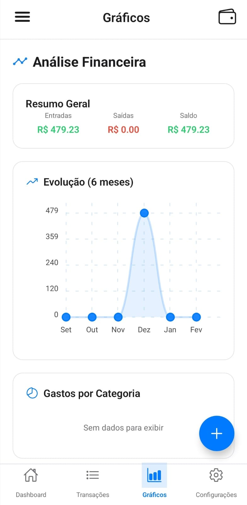

# FinanceApp - Gestão Financeira Pessoal

 &nbsp;&nbsp;
 &nbsp;&nbsp;
 &nbsp;&nbsp;
 &nbsp;&nbsp;


Aplicativo mobile de gestão financeira desenvolvido com React Native e Expo. Permite o controle manual de receitas e despesas, além da visualização de relatórios financeiros.

## 📱 Funcionalidades

✅ Autenticação local de usuários (login/registro)

✅ Adicionar, editar e excluir transações manualmente

✅ Categorização de gastos e receitas

✅ Dashboard com resumo financeiro

✅ Gráficos de receitas e despesas

✅ Visualização de gastos por categoria

✅ Tema claro/escuro

✅ Alteração de senha e preferências do usuário

✅ Funciona offline (dados armazenados localmente)

✅ Tela de ajuda e informações sobre o app


## 📸 Screenshots

<p align="center">
  
  
  
  
  
</p>

## 🚀 Tecnologias

- **React Native** - Framework mobile multiplataforma
- **Expo (CLI & Go)** - Plataforma de desenvolvimento e testes
- **JavaScript / JSX** - Linguagem do projeto
- **React Hooks (useState, useEffect, useContext)** - Gerenciamento de estado e efeitos
- **Context API** - Estado global (Auth, Theme, Transaction)
- **AsyncStorage** - Armazenamento local persistente
- **React Native SVG** - Gráficos e ícones
- **React Native Chart Kit** - Visualização de dados

## 🎨 Design e Usabilidade

- O FinanceApp foi desenvolvido com foco em simplicidade e clareza, priorizando a experiência do usuário.
- Cores neutras e minimalistas: facilitam a leitura e tornam a interface mais limpa.
- Layout intuitivo: navegação clara entre telas (Dashboard, Transações, Gráficos e Configurações).
- Funcionalidade em primeiro lugar: cada elemento do app tem propósito definido, evitando excesso de detalhes visuais.
- Modo claro/escuro: permite personalização rápida da aparência, mantendo a consistência.

## 🧠 Aprendizado
Durante o desenvolvimento do FinanceApp, aprofundei meus conhecimentos em:

- Estruturação e organização de aplicações React Native
- Gerenciamento de estado global com Context API
- Persistência de dados utilizando AsyncStorage
- Implementação de autenticação local
- Criação de gráficos dinâmicos a partir de dados manipulados
- Implementação de tema claro/escuro com controle global
- Organização de código visando escalabilidade e manutenção
- Aplicação de boas práticas de UX para mobile

Este projeto foi essencial para consolidar minha base em desenvolvimento mobile e reforçar conceitos importantes de arquitetura, usabilidade e organização de código.

## 📋 Pré-requisitos

Antes de rodar o app, certifique-se de ter instalado:

- **Node.js** (v14 ou superior) – necessário para rodar o ambiente React Native  
- **npm** ou **yarn** – gerenciador de pacotes  
- **Expo CLI** – ferramenta para criar, desenvolver e testar apps React Native  
- **Expo Go** (app no celular) ou emulador Android/iOS – para executar o app em dispositivos físicos ou simulados

## 🔧 Instalação

1. **Clone o repositório:**
```bash
git clone https://github.com/Flavinha-Souza/FinanceApp.git
cd FinanceApp
```

2. Instale as dependências:
```bash
npm install

# ou, se usar yarn:
# yarn
```

3. Inicie o projeto:
```bash
npm start
# ou, se usar yarn:
# yarn start
```

4. Escaneie o QR code com o Expo Go no seu celular ou pressione no terminal:
   - `a` para Android
   - `i` para iOS
   - `w` para Web

## 📁 Estrutura do Projeto

```
FinanceApp/
├── src/
│ ├── components/ # Componentes reutilizáveis (botões, cards, inputs, etc.)
│ ├── context/ # Context API para estado global (Auth, Theme, Transaction)
│ ├── screens/ # Telas do app (Login, Registro, Dashboard, etc.)
│ ├── services/ # Lógica de negócio e manipulação de dados
│ └── utils/ # Funções auxiliares e utilitários (criptografia, limpeza de dados)
├── assets/ # Imagens, ícones e arquivos de mídia
├── App.js # Componente raiz do React Native
├── app.json # Configurações do Expo
└── package.json # Dependências e scripts do projeto

## 🔒 Segurança

- Validação básica de inputs
- Dados armazenados localmente no dispositivo
- Nenhuma informação sensível exposta em logs

⚠️ **Nota**: Este é um projeto de demonstração. Não indicado para uso em produção sem reforço de segurança.


## 📝 Scripts Disponíveis

```bash
npm start          # Inicia o Expo
npm run android    # Abre no Android
npm run ios        # Abre no iOS
npm run web        # Abre no navegador
```

## 🤝 Contribuindo

Contribuições são bem-vindas! Veja o guia completo em [CONTRIBUTING.md](CONTRIBUTING.md)  

---

## 📦 Build do aplicativo

- APK gerado para testes e demonstração  
- App rodando fora do ambiente de desenvolvimento  
- Simulação de ciclo real de app mobile  

---

## 📄 Licença

Este projeto está sob a licença **MIT**. Veja o arquivo [LICENSE](LICENSE) para mais detalhes.  

---

## 👨‍💻 Autor

Desenvolvido por **Flávia Souza** – Desenvolvedora Front-end Web e Mobile Júnior  

⭐ Se este projeto te ajudou, considere dar uma **estrela** no GitHub!
